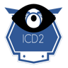

ICD2 - HLS Central West ICD10 Bot
=================================

{width="1.3333333333333333in"
height="1.3333333333333333in"}

Overview
========

Components
==========

ICD2DB
------

This is a [Microsoft SQL
Server](https://azure.microsoft.com/en-us/services/sql-database/)
database with a single table (ICD10Codes). Each row in the table
contains an ICD10 code, and its associated text description. A
[full-text
index](https://docs.microsoft.com/en-us/sql/relational-databases/search/full-text-search?view=sql-server-2017)
on the table allows for ICD10 codes to be looked up using natural text
search.

ICD2-BOT
--------

A bot built using the [Microsoft Bot
Framework](https://dev.botframework.com/),
[NodeJS](https://nodejs.org/en/), and
[TypeScript](https://www.typescriptlang.org/) that handles user input
for searching ICD10 codes.

{width="3.0in" height="1.7342946194225721in"}

Figure 1: ICD2-Bot in Action

Deployment
==========

Tools Needed
------------

-   An [Azure](https://azure.microsoft.com/en-us/) Subscription that
    will host the ICD2 components.

-   [SQL Server Management
    Studio](https://docs.microsoft.com/en-us/sql/ssms/download-sql-server-management-studio-ssms?view=sql-server-2017)
    for deploying the ICDDB database to Azure.

-   (Optional) [Visual Studio Code](https://code.visualstudio.com/) for
    local development.

-   (Optional) [NGrok](https://ngrok.com/) for local development and
    debugging.

Step 1: Deploy the ICD2DB Database to Azure
-------------------------------------------

### Installation

While you can use the database scripts located in the *db* folder to
create the database manually, the **easiest** way to get the database up
and running is to perform the following:

1)  Download *\*ICD2DB.bacpac\** to your local machine from
    [here](https://github.com/SmartterHealth/icd2-bot/blob/master/db/ICD2DB.bacpac).

2)  Upload the *\*ICD2DB.bacpac\** file to [Azure Blob
    Storage](https://docs.microsoft.com/en-us/azure/machine-learning/team-data-science-process/move-data-to-azure-blob-using-azure-storage-explorer).

3)  Import the *\*ICD2DB.bacpac\** blob into [Azure SQL
    Server](https://docs.microsoft.com/en-us/azure/sql-database/sql-database-import#import-from-a-bacpac-file-using-azure-portal).

4)  **Recommended:** Using [SQL Server Management
    Studio](https://docs.microsoft.com/en-us/sql/ssms/download-sql-server-management-studio-ssms?view=sql-server-2017),
    create a \[SQL Login\]\[sqllogin\] and add to the *\*dbdatareader\**
    role for the database. Use this login when connecting to the
    database from the ICD2 bot. **\*\*Do not\*\*** use the admin
    password.

You will need your database name, login, and password for the next
steps.

### Did it Work?

You can test the installation of the database by executing the following
stored procedure from \[[SQL Server Management
Studio](https://docs.microsoft.com/en-us/sql/ssms/download-sql-server-management-studio-ssms?view=sql-server-2017):

> EXEC    \[dbo\].\[SEARCH\_CODES\] \@keywords = N\'edema orbit\'

If you get errors running the stored procedure, check the following:

\* Ensure that the **SEARCH\_CODES** stored procedure has been created.

\* Ensure the current user has execute permissions to the
**SEARCH\_CODES** stored procedure. The user only needs *read*
permissions for the **ICD10Codes** table.

\* Ensure that the **ICD10Codes** table has a *FULL TEXT INDEX* on all
columns.

Step 2: Deploy the ICD2 Bot to Azure
------------------------------------

### Create the Azure Web App Bot

Clone or [download the
\*.zip](https://github.com/SmartterHealth/icd2-bot/blob/master/deployment/icd2-bot.zip) for
the bot source code. If choosing the \*.zip download, extract the
contents to a working directory.

1.  First, Create a web app bot in Azure using the instructions
    located [here](https://docs.microsoft.com/en-us/azure/bot-service/bot-service-quickstart?view=azure-bot-service-4.0).

    -   Select a good bot name that is meaningful to you.

    -   Make sure you specify a location near you.

    -   Under **Bot Template**, ensure that **SDK Version** is set
        to *SDK v.4* and **SDK Language** is set to *Node JS*.
        Choose *Echo Bot*, as we will deploy over this in later steps.

    -   Remember the name of the bot you specified, as well as the
        resource group you selected. You will need them later during
        deployment.

> az bot publish \--name \"your-bot-name\" \--resource-group
> \"your-resource-group\" \--code-dir \<path to directory\>
